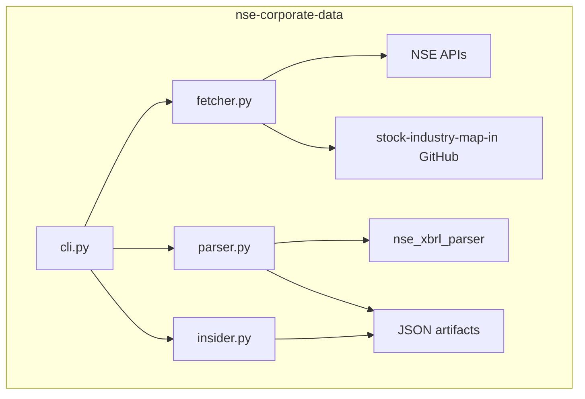

# Architecture

`cli.py` exposes grouped workflows: `further-issues fetch`, `insider-trading fetch`, and `insider-trading shorten`. Both fetch commands use canonical machine-facing repeatable options rather than upstream NSE labels: `--category pref|qip` for further issues and `--mode ...` tokens for insider trading, with internal expansion back to the raw NSE values. `fetcher.py` owns NSE session setup, JSON endpoint fetches, XBRL downloads, quote lookups, and cached industry-map retrieval; quote responses are cached per symbol to avoid repeated NSE hits within a run. `parser.py` normalizes heterogeneous NSE payloads through configurable symbol/XBRL field mapping, enriches each row with industry and CMP data, and can skip insider-trading XBRL parsing entirely when configuration disables it. `insider.py` contains both the canonical insider-mode mapping and the declarative short-output field registry used to derive `insider_trading_short.json` from the full insider artifact.
