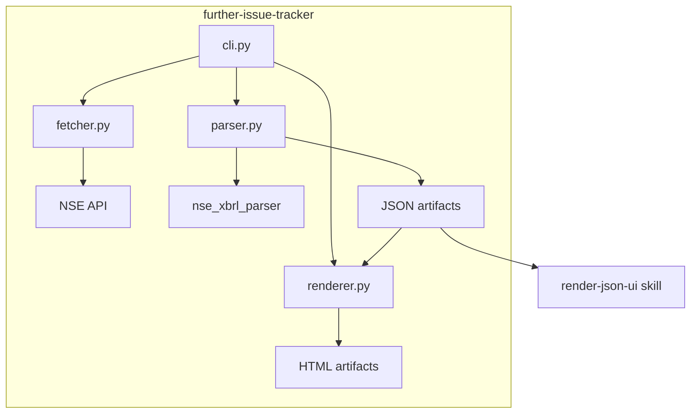

# Architecture

```mermaid
graph TD
    subgraph further-issue-tracker
        cli[cli.py]
        fetcher[fetcher.py]
        parser[parser.py]
        renderer[renderer.py]
        
        cli --> fetcher
        cli --> parser
        cli --> renderer
        fetcher --> nse[NSE API]
        parser --> nsexbrl[nse_xbrl_parser]
        parser --> json[JSON artifacts]
        renderer --> html[HTML artifacts]
    end

    json --> renderer
    json --> skill[render-json-ui skill]
```
